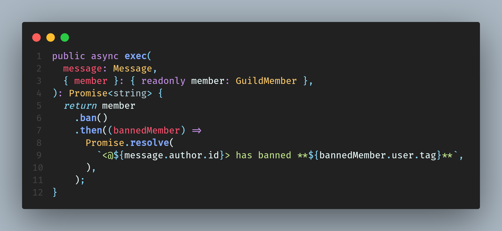

# Safire Bot

<!--
*** Thanks for checking out the Best-README-Template. If you have a suggestion
*** that would make this better, please fork the repo and create a pull request
*** or simply open an issue with the tag "enhancement".
*** Thanks again! Now go create something AMAZING! :D
***
***
***
*** To avoid retyping too much info. Do a search and replace for the following:
*** PhilosSofiaAlt, Safire, PhilosSofiaAlt, x@gmail.com, Safire, Safire is a feature-rich Discord Bot written in TypeScript
-->

<!-- PROJECT SHIELDS -->
<!--
*** I'm using markdown "reference style" links for readability.
*** Reference links are enclosed in brackets [ ] instead of parentheses ( ).
*** See the bottom of this document for the declaration of the reference variables
*** for contributors-url, forks-url, etc. This is an optional, concise syntax you may use.
*** https://www.markdownguide.org/basic-syntax/#reference-style-links
-->
[](https://gitlab.com/safire-project/discord-bot/safire/-/commits/master)
[](https://gitlab.com/safire-project/discord-bot/safire/-/commits/master)
[![Contributors][contributors-shield]][contributors-url]
[![Forks][forks-shield]][forks-url]
[![Issues][issues-shield]][issues-url]
[![MIT License][license-shield]][license-url]

<!-- PROJECT LOGO -->
 [](https://gitlab.com/safire-project/discord-bot/safire)

## Safire

Safire is a feature-rich Discord Bot written in TypeScript

[**Explore the docs »**](https://gitlab.com/safire-project/discord-bot/safire/-/tree/master/docs)

[](https://discord.gg/CXbmPSvukZ)

[View Demo](https://discord.gg/CXbmPSvukZ) · [Report Bug or Request Feature](https://gitlab.com/safire-project/discord-bot/safire/-/issues) · [Visit Jira](https://safireproject.atlassian.net/)

## Table of Contents

- [Safire Bot](#safire-bot)
  - [Safire](#safire)
  - [Table of Contents](#table-of-contents)
  - [About The Project](#about-the-project)
    - [Built With](#built-with)
  - [Getting Started](#getting-started)
    - [Prerequisites](#prerequisites)
    - [Installation](#installation)
  - [Usage](#usage)
    - [Docker Compose](#docker-compose)
    - [Docker](#docker)
    - [PM2](#pm2)
    - [Node](#node)
  - [Roadmap](#roadmap)
  - [Contributing](#contributing)
  - [License](#license)
  - [Contact](#contact)
  - [Acknowledgements](#acknowledgements)
    - [Dependencies](#dependencies)
    - [Development Dependencies](#development-dependencies)
    - [Asset Attribution](#asset-attribution)
    - [Disclaimer](#disclaimer)

<!-- ABOUT THE PROJECT -->
## About The Project

[](https://gitlab.com/safire-project/discord-bot/safire)

Safire is written with modern frameworks and highly opinionated style choices.

It is a rewrite of [Ember](https://gitlab.com/BrynAlt/ember-bot) in the Sapphire framework.

### Built With

- [___TypeScript___](https://www.typescriptlang.org/)
- [node.js](https://nodejs.org/en/)
- [discord.js](https://discord.js.org/#/)
- [Sapphire](https://github.com/sapphiredev/framework)
- [___GraphQL___](https://graphql.org/)
- [Prisma](https://www.prisma.io/)
- [GraphQL Nexus](https://nexusjs.org/)
- [___Jest___](https://jestjs.io/)
- [ts-jest](https://github.com/kulshekhar/ts-jest)
- [___ESLint___](https://eslint.org/)
- [AirBNB Style Guide](https://github.com/airbnb/javascript)

<!-- GETTING STARTED -->
## Getting Started

To get a local copy up and running follow these simple steps.

### Prerequisites

- npm

  ```sh
  npm install npm@latest -g
  ```

### Installation

1. Clone the repo

   ```sh
   git clone https://gitlab.com/safire-project/discord-bot/safire.git
   ```

2. Install NPM packages

   ```sh
   npm install
   ```

<!-- USAGE EXAMPLES -->
## Usage

The following can be used to run Safire, in order of preference.

Before doing any of them populate a `.env` with a single line `DISCORD_TOKEN=xxxx...`

### Docker Compose

   ```sh
   docker-compose up
   ```

### Docker

   ```sh
   docker build -t safire .
   docker run safire
   ```

### PM2

   ```sh
   npx run pm2
   npx run pm2stop
   ```

### Node

   ```sh
   npm start
   ```

_For further examples and explanations, please refer to the [Documentation](https://gitlab.com/safire-project/discord-bot/safire/-/tree/master/docs)_

<!-- ROADMAP -->
## Roadmap

See the [open issues](https://gitlab.com/safire-project/discord-bot/safire/-/issues) for a list of proposed features (and known issues).

<!-- CONTRIBUTING -->
## Contributing

Please read the available documentation in the [Contributing Section](https://gitlab.com/safire-project/discord-bot/safire/-/tree/master/docs)

Contributions are what make the open source community such an amazing place to be learn, inspire, and create. Any contributions you make are **greatly appreciated**.

1. Fork the Project
2. Create your Feature Branch (`git checkout -b feature/AmazingFeature`)
3. Commit your Changes (`git commit -m 'Add some AmazingFeature'`)
4. Push to the Branch (`git push origin feature/AmazingFeature`)
5. Open a Pull Request, make sure to follow [the commit guidelines](docs/commits.md)

<!-- LICENSE -->
## License

 [](https://opensource.org/licenses/MIT)
 [](http://creativecommons.org/publicdomain/zero/1.0/)

Distributed under the MIT License. See `contributing/license/mit.md` for more information.
The project is also distributed under the CC0 License. See the [license.md](license.md) for more information.

<!-- CONTACT -->
## Contact

Bryn/Sofia - [@PhiloSofiaAlt](https://twitter.com/PhiloSofiaAlt)

Project Link: [Gitlab](https://gitlab.com/safire-project/discord-bot/safire) - [Github](https://github.com/Safire-Project/Safire-Bot)

<!-- ACKNOWLEDGEMENTS -->
## Acknowledgements

### Dependencies

- [Apollo Server](https://github.com/apollographql/apollo-server)
- [dotenv](https://github.com/motdotla/dotenv)
- [fuzzy-search](https://github.com/wouter2203/fuzzy-search)
- [winston](https://github.com/winstonjs/winston)
- [winston-daily-rotate-file](https://github.com/winstonjs/winston-daily-rotate-file)

### Development Dependencies

- [Airbnb Style Guide](https://github.com/airbnb/javascript)
- [Functional TypeScript Style Guide](https://github.com/jonaskello/eslint-plugin-functional#readme)
- [Promise Style Guide](https://github.com/xjamundx/eslint-plugin-promise#readme)
- [Prettier](https://prettier.io/)
- [Rimraf](https://github.com/isaacs/rimraf)
- [TSDoc](https://tsdoc.org/)
- [TS Node](https://github.com/TypeStrong/ts-node)
- [TS Node Dev](https://github.com/whitecolor/ts-node-dev)
- [TypeDoc](https://typedoc.org/)
- [Unicorn](https://github.com/sindresorhus/eslint-plugin-unicorn)

<!-- MARKDOWN LINKS & IMAGES -->
<!-- https://www.markdownguide.org/basic-syntax/#reference-style-links -->
[contributors-shield]: https://img.shields.io/badge/Contributors-gitlab-success.svg
[contributors-url]: https://gitlab.com/safire-project/discord-bot/safire/-/graphs/master
[forks-shield]: https://img.shields.io/badge/Forks-gitlab-informational.svg
[forks-url]: https://gitlab.com/safire-project/discord-bot/safire/-/forks
[stars-shield]: https://img.shields.io/badge/Stars-gitlab-yellow.svg
[stars-url]: https://gitlab.com/safire-project/discord-bot/safire/-/starrers
[issues-shield]: https://img.shields.io/badge/Issues-gitlab-critical.svg
[issues-url]: https://gitlab.com/safire-project/discord-bot/safire/-/issues
[license-shield]: https://img.shields.io/badge/License-MIT-red
[license-url]: https://gitlab.com/safire-project/discord-bot/safire/-/blob/master/license.md
[product-screenshot]: src/assets/img/code.png

### Asset Attribution

Safire utilized the following assets for developing its icon:

- [Fire by Kiranshastry](https://www.flaticon.com/free-icon/fire_876691)
- [Hashtag by Freepik](https://www.flaticon.com/free-icon/hashtag_1076982)

### Disclaimer

We are not associated with the Sapphire Project.
